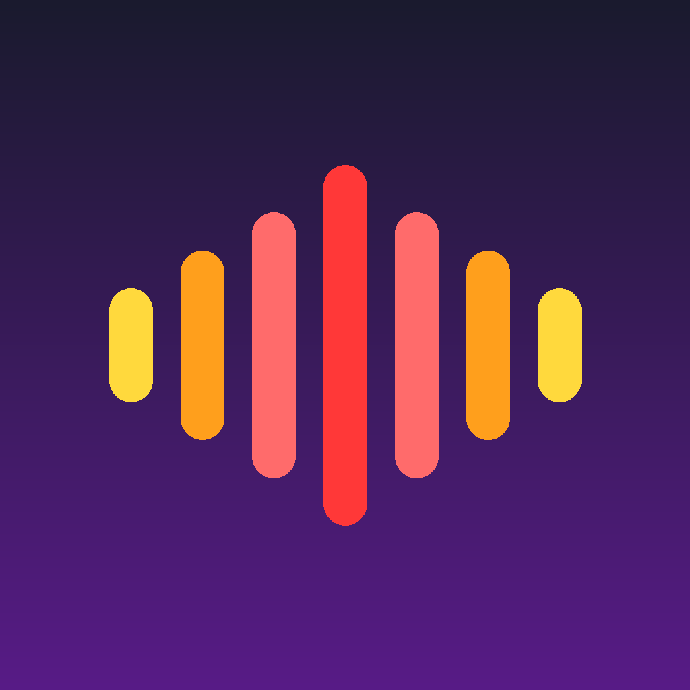
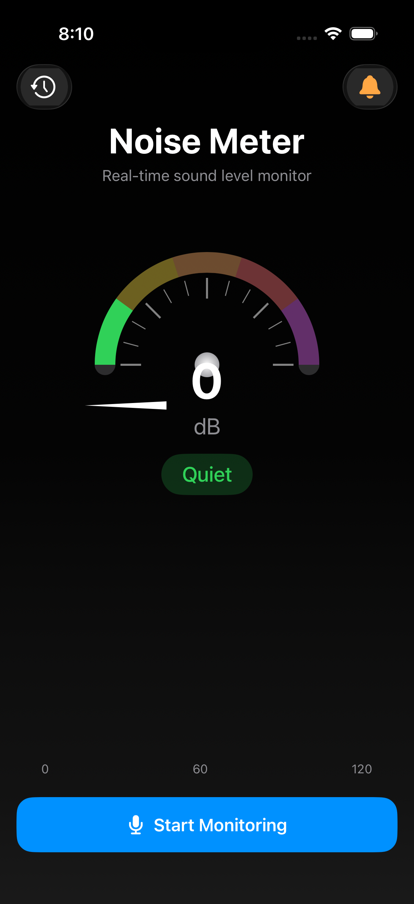
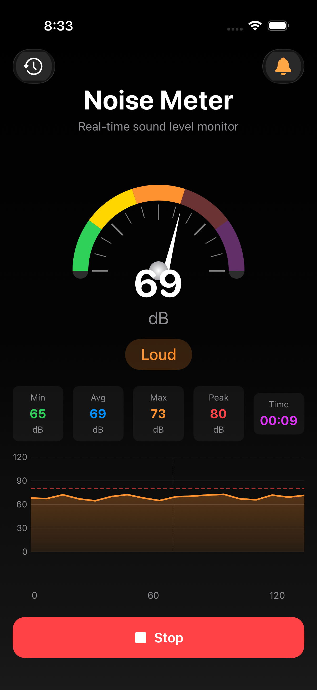
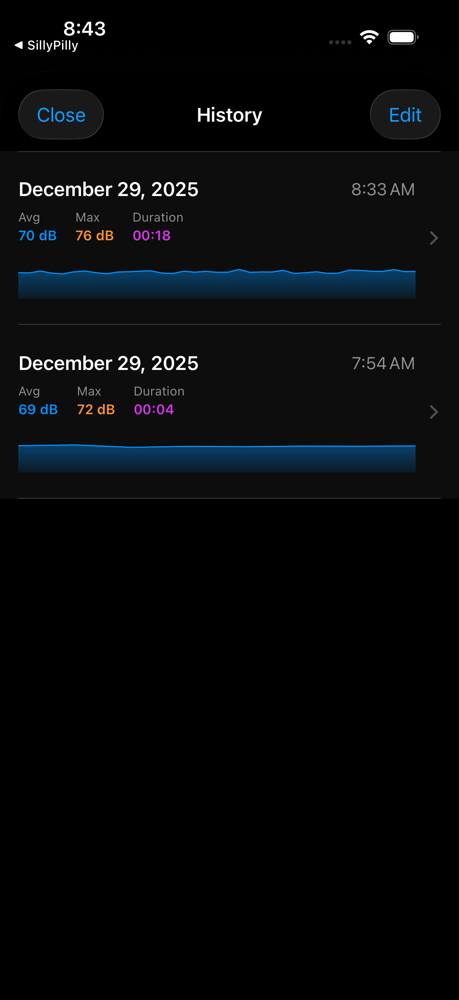
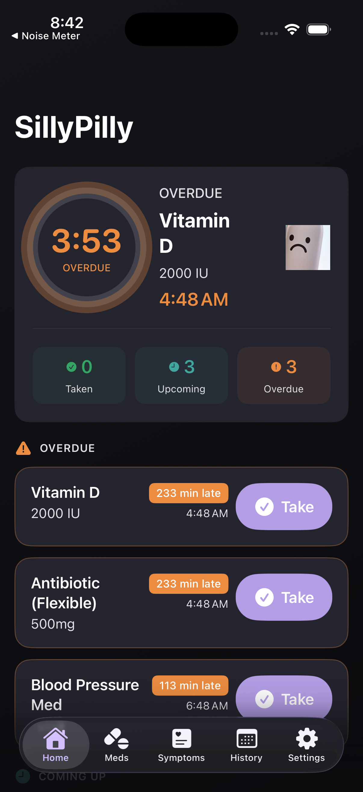

# NoiseMeter

<p align="center">
  
</p>

<p align="center">
  <strong>A real-time noise level monitoring app for iOS</strong>
</p>

<p align="center">
  
  
  
  
</p>

---

## Features

### 📊 Real-Time Monitoring
- Live decibel measurement using device microphone
- Visual gauge/meter with smooth animations
- Color-coded levels (green → yellow → orange → red → purple)
- Noise level descriptions (Quiet, Moderate, Loud, Very Loud, Dangerous)

### 📈 Statistics & History
- Min, max, average, and peak dB tracking
- Real-time history graph using Swift Charts
- Session duration timer
- Data saved every 0.5 seconds

### 🔔 Smart Alerts
- Configurable threshold alerts (50-110 dB)
- Haptic feedback when noise exceeds threshold
- Visual alert banner with trigger count
- Reference levels for common sounds

### 💾 Session Persistence
- Automatic session saving
- View past monitoring sessions
- Detailed session statistics
- Full history charts with threshold markers

### 📱 Home Screen Widget
- Small, medium, and large widget sizes
- Quick access to start monitoring
- Beautiful dark gradient design

---

## Screenshots

<p align="center">
  
  
  
</p>

<p align="center">
  
  
  
</p>

---

## Requirements

- iOS 17.0+
- Xcode 15.0+
- Swift 5.9+

---

## Installation

### Using XcodeGen (Recommended)

1. Clone the repository:
   ```bash
   git clone https://github.com/kassel555/NoiseMeter.git
   cd NoiseMeter
   ```

2. Install XcodeGen if you haven't:
   ```bash
   brew install xcodegen
   ```

3. Generate the Xcode project:
   ```bash
   xcodegen generate
   ```

4. Open the project:
   ```bash
   open NoiseMeter.xcodeproj
   ```

5. Select your development team in Xcode and run on your device.

### Manual Setup

1. Clone the repository
2. Open `NoiseMeter.xcodeproj` in Xcode
3. Update the signing team in project settings
4. Build and run

---

## Project Structure

```
NoiseMeter/
├── NoiseMeter/
│   ├── Sources/
│   │   ├── App/
│   │   │   └── NoiseMeterApp.swift
│   │   ├── Managers/
│   │   │   ├── AudioManager.swift      # Audio recording & dB calculation
│   │   │   └── DataManager.swift       # Session persistence
│   │   └── Views/
│   │       ├── ContentView.swift       # Main screen
│   │       ├── GaugeView.swift         # Circular meter UI
│   │       ├── HistoryGraphView.swift  # Real-time chart
│   │       ├── StatisticsView.swift    # Stats display
│   │       ├── AlertSettingsView.swift # Alert configuration
│   │       └── SessionHistoryView.swift # Past sessions
│   ├── Assets.xcassets/
│   └── Info.plist
├── NoiseMeterWidget/
│   ├── NoiseMeterWidget.swift          # Widget extension
│   ├── Assets.xcassets/
│   └── Info.plist
└── project.yml                          # XcodeGen configuration
```

---

## How It Works

### Decibel Measurement

The app uses `AVAudioRecorder` to capture audio and measure sound levels:

1. Audio session configured for measurement mode
2. Meter readings taken 20 times per second (0.05s interval)
3. Raw power values converted to normalized 0-120 dB scale
4. History recorded every 0.5 seconds

### Noise Level Categories

| Level | Range | Color |
|-------|-------|-------|
| Quiet | 0-30 dB | 🟢 Green |
| Moderate | 30-50 dB | 🟡 Yellow |
| Loud | 50-70 dB | 🟠 Orange |
| Very Loud | 70-90 dB | 🔴 Red |
| Dangerous | 90+ dB | 🟣 Purple |

---

## Privacy

NoiseMeter requires microphone access to measure ambient noise levels. Audio is processed locally on-device and is **never recorded, stored, or transmitted**. Only numerical decibel readings are saved.

---

## License

This project is available under the MIT License. See the [LICENSE](LICENSE) file for details.

---

## Acknowledgments

- Built with SwiftUI and Swift Charts
- Icon features sound wave visualization
- Inspired by professional sound level meters

---

<p align="center">
  Made with ❤️ using Claude Code
</p>
